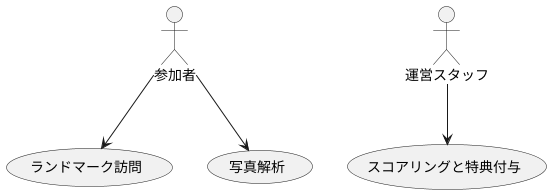
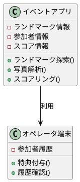

## ソフトウェア要求仕様書（SRS）

#### 1. 概要（Introduction）

**1.1 目的（Purpose）**
1.1.1 SRSの目的
このSRSは、「こんこんプロジェクト」のソフトウェア要求を詳細に記述し、開発チーム、運用担当者、およびその他のステークホルダー間で共通理解を確立することを目的とします。

1.1.2 対象読者
- 開発チーム
- 運用担当者
- ステークホルダー
- QA/テストチーム

**1.2 スコープ（Scope）**
1.2.1 ソフトウェア製品の名前
「こんこんプロジェクト」

1.2.2 ソフトウェア製品の機能と制限
- 機能: ランドマーク探索、写真アップロードと解析、スコアリング、運営ステーションからの特典付与
- 制限: 独自アプリ開発なし（既存チャットアプリ拡張）、キャンパスマップ・ナビゲーションなし、QRコードの読み取りなし

1.2.3 利用する目的や目標
キャンパスの歴史や特色を学べるオープンキャンパスミニイベントで、参加者のエンゲージメントを高める。

**1.3 定義、頭字語、略語（Definitions, Acronyms, and Abbreviations）**
1.3.1 用語の定義
- イベントアプリ
- イベントガイド
- オペレータ端末
- ステーション
- ランドマーク

1.3.2 略語のリスト
- OCR: Optical Character Recognition（画像文字認識）

**1.4 参考文献（References）**
1.4.1 参照文献のリスト
- IEEE 830: IEEE Recommended Practice for Software Requirements Specifications

**1.5 概要（Overview）**
1.5.1 SRSの構成と内容の説明
このSRSでは、製品の概要、機能、インタフェース要求、ユーザーストーリー、データ管理、外部インタフェースなどを詳細に説明します。

#### 2. 全体的な説明（Overall Description）

**2.1 製品の視点（Product Perspective）**
2.1.1 製品の文脈と関連システム
- イベントアプリは既存のチャットアプリの拡張機能として実装される。

2.1.2 ブロック図
- メインシステムと外部システムとの関係を示す。

2.1.3 システムインタフェース
- チャットアプリとのインタフェース

2.1.4 ユーザーインターフェース
- モバイルアプリUI

2.1.5 ハードウェアインターフェース
- スマートフォン、タブレット

2.1.6 ソフトウェアインターフェース
- チャットアプリのAPI
- 画像認識API

2.1.7 通信インターフェース
- インターネット接続

2.1.8 メモリ制約
- スマートフォンのメモリ容量内で動作すること

2.1.9 運用環境
- 運営ステーションのネットワーク環境
- 参加者のスマートフォン

2.1.10 サイトへの適応要件
- 既存キャンパス内の運用ステーション、ランドマーク

**2.2 製品機能（Product Functions）**
2.2.1 ソフトウェアが実行する主な機能の概要
- ランドマーク訪問と写真アップロード
- 画像認識とスコアリング
- 運営ステーションでの特典付与

**2.3 ユーザー特性（User Characteristics）**
2.3.1 予想されるユーザーの特性
- 中高生、保護者、教育関係者（技術的専門知識は必要最低限）

**2.4 制約条件（Constraints）**
2.4.1 規制政策
- 個人情報保護法に準拠する

2.4.2 ハードウェアの制限
- ユーザーが持ち込むデバイスに依存

2.4.3 他のアプリケーションとのインタフェース
- 既存のチャットアプリ

2.4.4 並列運転
- 単一アプリ運用のため無関係

2.4.5 監査機能
- イベント終了後に全データをレビュー可能

2.4.6 制御機能
- アプリのセキュリティポリシーに依存

2.4.7 高次言語要件
- 無し

2.4.8 信頼性要件
- 画像認識精度、マルチデバイス対応

**2.5 前提条件と依存関係（Assumptions and Dependencies）**
2.5.1 SRSに記載された要件に影響を与える要因
- チャットアプリのAPIの安定性
- 画像認識技術の精度

**2.6 要求事項の配分（Requirements Allocation）**
2.6.1 将来のバージョンに遅れる可能性のある要件
- キャンパスマップ・ナビゲーション機能の追加

#### 3. 特定要求事項（Specific Requirements）

**3.1 外部インタフェース要求（External Interface Requirements）**
3.1.1 ユーザーインタフェース
- 3.1.1.1 画面形式
  - スマートフォン向けのレスポンシブデザイン
- 3.1.1.2 ページやウィンドウのレイアウト
  - 簡潔で利用しやすいナビゲーション
- 3.1.1.3 レポートやメニューの内容
  - ランドマークリスト、スコア状況、特典リスト

3.1.2 ハードウェアインタフェース
- 3.1.2.1 構成特性
  - Android、iOS対応スマートフォン
- 3.1.2.2 サポートするデバイスとプロトコル
  - Bluetooth、Wi-Fi、4G/5G

3.1.3 ソフトウェアインタフェース
- 3.1.3.1 必須ソフトウェア製品
  - 名称: XXXXチャットアプリ
  - 仕様番号: XXXX-1.0
  - バージョン番号: 1.2.3
  - ソース: XXXX社

- 3.1.3.2 メッセージの内容と形式
  - JSON/XML形式、イベントデータ

3.1.4 通信インタフェース
- 3.1.4.1 ローカルネットワークのプロトコル
  - TCP/IP

**3.2 機能要求（Functional Requirements）**
3.2.1 システムが提供する具体的な機能
- 3.2.1.1 ランドマーク探索
  - 3.2.1.1.1 インプット: 利用者の位置データ、ランドマークの位置情報
  - 3.2.1.1.2 プロセス: ランドマーク情報提供、位置確認
  - 3.2.1.1.3 アウトプット: ランドマーク訪問確認、メッセージ送信

- 3.2.1.2 写真アップロードと解析
  - 3.2.1.2.1 インプット: ユーザーが撮影した写真
  - 3.2.1.2.2 プロセス: 写真のアップロード、画像解析
  - 3.2.1.2.3 アウトプット: 記録、解説テキスト、スコア表示

- 3.2.1.3 スコアリングと特典付与
  - 3.2.1.3.1 インプット: ユーザーの活動履歴
  - 3.2.1.3.2 プロセス: スコア計算、特典判定
  - 3.2.1.3.3 アウトプット: スコア表示、特典リスト

3.2.2 ユーザーストーリーやユースケース
- 3.2.2.1 ユースケース1: ランドマーク訪問
  - 3.2.2.1.1 アクター: 参加者
  - 3.2.2.1.2 前提条件: イベントガイド入手済み、チャットアプリインストール済み
  - 3.2.2.1.3 基本フロー: イベントアプリを起動、ランドマークを探す、訪問記録
  - 3.2.2.1.4 代替フロー: 位置情報が取得できない場合、再試行メッセージ
  - 3.2.2.1.5 後処理条件: 訪問記録、次のランドマークの詳細提供

- 3.2.2.2 ユースケース2: 写真解析
  - 3.2.2.2.1 アクター: 参加者
  - 3.2.2.2.2 前提条件: ランドマーク訪問済み、写真撮影済み
  - 3.2.2.2.3 基本フロー: 写真アップロード、画像解析、解説テキスト表示
  - 3.2.2.2.4 代替フロー: 画像解析失敗時、再アップロード
  - 3.2.2.2.5 後処理条件: スコアリング、履歴保存

3.2.3 データの処理および管理
- 3.2.3.1 データ入力
  - 3.2.3.1.1 入力データの形式: JPEG/PNG（画像）、GPSデータ
  - 3.2.3.1.2 データの検証方法: ファイル形式チェック、GPSデータ整合性チェック
  - 3.2.3.1.3 データの入力手順: フォームを通じたアップロード
- 3.2.3.2 データ処理
  - 3.2.3.2.1 データの加工方法: OCR/画像解析、クレンジング
  - 3.2.3.2.2 データの変換方法: JSONへの変換
  - 3.2.3.2.3 データの計算方法: スコアリングアルゴリズム適用
- 3.2.3.3 データ出力
  - 3.2.3.3.1 出力データの形式: JSON
  - 3.2.3.3.2 データの出力先: スマートフォンディスプレイ
  - 3.2.3.3.3 データの出力手順: 自動表示
- 3.2.3.4 データ管理
  - 3.2.3.4.1 データの保存方法: クラウドストレージ
  - 3.2.3.4.2 バックアップ方法: デイリーバックアップ
  - 3.2.3.4.3 データのリストア方法: 管理者ポータルから手動リストア

3.2.4 外部システムとのインターフェース
- 3.2.4.1 チャットアプリとのインタフェース
  - 3.2.4.1.1 インターフェースの目的: イベント通知、メッセージ送信
  - 3.2.4.1.2 データの交換形式: JSON
  - 3.2.4.1.3 インターフェースプロトコル: HTTP/HTTPS
  - 3.2.4.1.4 エラーハンドリング: エラー通知、再送信メカニズム

#### 4. 付録（Appendices）

**4.1 用語集（Glossary）**
4.1.1 用語の定義
- イベントアプリ: オープンキャンパスミニイベント専用のモバイルアプリケーション
- イベントガイド: イベントのルールやマップが記載された紙媒体
- オペレータ端末: 運営スタッフが活動履歴を確認できるデバイス
- ステーション: イベント開始および終了の拠点
- ランドマーク: キャンパス内の重要地点

**4.2 分析モデル（Analysis Models）**
4.2.1 ユースケース図

4.2.2 クラス図

**4.3 その他の付録（Other Appendices）**
4.3.1 その他の関連情報や補足資料
- APIドキュメント
- テストケースリスト

#### 5. 索引（Index）

**5.1 索引（Index）**
5.1.1 重要な用語やトピックの索引
- イベントアプリ: 1.3, 2.1, 2.2, 3.2.1
- オペレータ端末: 1.3, 2.1, 3.2.1, 3.2.4.1
- ランドマーク: 1.3, 2.2, 3.2.1, 4.1
- 写真解析: 3.2.1.2, 3.2.3.2

上記が「こんこんプロジェクト」のSRSです。このドキュメントを基に、開発およびテストを進めていきます。